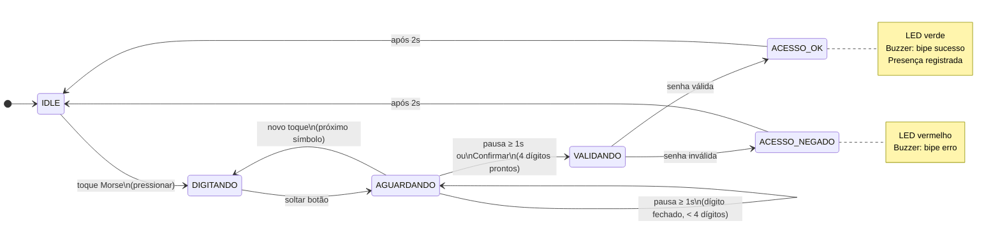

# Relatório — Sistema de Presença por Código Morse com Raspberry Pi 3

**Grupo R** — Laboratório de Processadores — Escola Politécnica da USP


| Integrante                     | NUSP     |
| ------------------------------ | -------- |
| Caique Granja Maia             | 12555572 |
| João Ricardo Rodrigues Ribeiro | 14582802 |
| Stephanie Pedrazza Grunwald    | 11233522 |


**Repositório:** [https://github.com/CaiqueG/LabProcGrupoR-ProjetoFinal](https://github.com/CaiqueG/LabProcGrupoR-ProjetoFinal)

---

## 1. Motivação e Justificativa

O controle de presença manual em sala de aula é um processo lento, sujeito a erros humanos e suscetível a fraudes (um aluno assinando por outro, por exemplo). Soluções digitais existentes geralmente dependem de conectividade à internet ou de hardware proprietário (leitores de crachá, biometria), o que aumenta o custo e a complexidade de implantação.

Este projeto propõe uma alternativa de baixo custo, autônoma e educativa: um sistema embarcado no **Raspberry Pi 3** que realiza o controle de presença por meio de **código Morse numérico**. Cada aluno possui uma senha de 4 dígitos que é inserida pressionando um único botão físico, combinando toques curtos (pontos) e longos (traços).

Além do aspecto prático, o projeto consolida diretamente os conceitos trabalhados ao longo do laboratório:

- **Decodificação por temporização** (Aula 2 e Aula 9): o sistema distingue ponto de traço pela duração do toque.
- **Especificação formal de requisitos** (Aulas anteriores): projeto orientado a RF e RNF desde o início.
- **PWM e temporização não-bloqueante** (Aula 9): arquitetura orientada a eventos, sem busy-waiting.
- **Integração de periféricos via GPIO e I2C** (Aula 10): LCD, botões, LEDs, buzzer e máquina de estados integrados.

Projetos similares de controle de acesso embarcado em Raspberry Pi podem ser encontrados em:

- Raspberry Pi Foundation — *Physical computing with Python*. Disponível em: [https://projects.raspberrypi.org/en/projects/physical-computing](https://projects.raspberrypi.org/en/projects/physical-computing)
- Freenove — *Freenove Ultimate Starter Kit for Raspberry Pi*. Disponível em: [https://docs.freenove.com](https://docs.freenove.com)

---


## 2. Objetivos


### 2.1 Objetivo Geral

Desenvolver um sistema embarcado de controle de presença em sala de aula, executado no Raspberry Pi 3, que permita a identificação de alunos por meio de senha numérica inserida em código Morse, com registro local e interface web de monitoramento.

### 2.2 Objetivos Específicos

1. Implementar um decodificador de código Morse numérico (dígitos 0–9, padrão ITU-R M.1677) capaz de distinguir pontos e traços pela duração do toque em um botão físico.
2. Integrar uma base de dados local (arquivo JSON) para validação de senhas e um histórico de presenças (arquivo CSV) com registro de data e hora.
3. Fornecer feedback multimodal ao usuário: LED verde/vermelho, bipe no buzzer e mensagem no display LCD 1602 via I2C.
4. Desenvolver uma interface web (Flask) acessível pela rede local, atualizada em tempo real, exibindo o estado do sistema e o histórico de presenças.
5. Garantir uma arquitetura não-bloqueante, baseada em eventos (callbacks de GPIO), para que a leitura de botões e o servidor web operem simultaneamente sem interferência.

---


## 3. Requisitos Funcionais


| ID   | Descrição                                                                                                                                                                                                | Critério de Aceitação                                                                                                |
| ---- | -------------------------------------------------------------------------------------------------------------------------------------------------------------------------------------------------------- | -------------------------------------------------------------------------------------------------------------------- |
| RF1  | O sistema deve decodificar dígitos Morse (0–9) a partir de toques em um botão físico. Toque < 0,3s = ponto; toque ≥ 0,3s = traço. Cada dígito é formado por exatamente 5 símbolos (padrão ITU-R M.1677). | Pressionar a sequência correta de toques resulta no dígito esperado exibido no LCD e na interface web.               |
| RF1b | Uma pausa ≥ 1,0s sem tocar fecha automaticamente o dígito atual e aguarda o próximo.                                                                                                                     | Após 1s de inatividade, o dígito é fechado sem necessidade de confirmação manual.                                    |
| RF2  | Ao confirmar 4 dígitos, o sistema valida a senha contra o cadastro local. Se válida, registra a presença com nome, data e hora em arquivo CSV.                                                           | Presença registrada aparece no histórico da interface web e no CSV. LED verde acende e buzzer emite bipe de sucesso. |
| RF2b | Se a senha for inválida, o sistema sinaliza o erro e retorna ao estado de espera.                                                                                                                        | LED vermelho acende, buzzer emite bipe de erro, nenhum registro é feito no CSV.                                      |
| RF3  | O botão Cancelar limpa o buffer de entrada a qualquer momento, retornando o sistema ao estado inicial.                                                                                                   | Após pressionar Cancelar, LCD exibe "Digite a senha em Morse" e buffer é zerado.                                     |
| RF4  | O sistema deve exibir feedback no display LCD 1602 durante toda a interação: símbolos digitados, senha parcial, resultado da validação.                                                                  | LCD atualiza a cada toque, exibindo o estado atual da entrada.                                                       |
| RF5  | Uma interface web deve exibir em tempo real o estado do sistema (senha parcial, símbolo atual, resultado) e o histórico das últimas 10 presenças registradas.                                            | Página acessível em `http://<ip>:5000` atualiza automaticamente a cada 1 segundo.                                    |


---


## 4. Requisitos Não Funcionais


| ID   | Descrição                                                                                                                                              | Critério de Aceitação                                                                                                   |
| ---- | ------------------------------------------------------------------------------------------------------------------------------------------------------ | ----------------------------------------------------------------------------------------------------------------------- |
| RNF1 | Tempo de resposta da interface web inferior a 1 segundo após a confirmação.                                                                            | Medição com DevTools do navegador: latência do endpoint `/status` < 1s.                                                 |
| RNF2 | Debounce de ~50ms nos botões; sequências Morse inválidas (< 5 símbolos ou sem mapeamento) devem ser descartadas sem travar o sistema.                  | Pressionar o botão rapidamente não gera múltiplos eventos. Sistema retorna ao estado de espera após sequência inválida. |
| RNF3 | Arquitetura orientada a eventos (sem busy-waiting): leitura de botões via callbacks, servidor web em thread separada da FSM, buzzer em thread própria. | Digitar a senha e acessar a interface web simultaneamente não causa travamento ou perda de eventos.                     |
| RNF4 | Resiliência de hardware: ausência de LCD ou buzzer não deve impedir o funcionamento do sistema.                                                        | Sistema inicializado sem LCD conectado exibe mensagens no console; sem buzzer, continua sem áudio e sem erro fatal.     |


---


## 5. Arquitetura da Solução


### 5.1 Arquitetura Física

O sistema é executado inteiramente no **Raspberry Pi 3 Model B** (SoC Broadcom BCM2837, ARM Cortex-A53 quad-core 1,2 GHz, 1 GB RAM, Raspberry Pi OS). Os periféricos são conectados diretamente aos pinos GPIO:


| Componente       | Interface     | Pino BCM        | Função                             |
| ---------------- | ------------- | --------------- | ---------------------------------- |
| Botão Morse      | GPIO digital  | 26              | Botão S4 da placa Freenove         |
| Botão Confirmar  | GPIO digital  | 18              | Botão externo na protoboard        |
| Botão Cancelar   | GPIO digital  | 23              | Botão externo na protoboard        |
| LED Verde        | GPIO digital  | 17              | LED da placa Freenove              |
| LED Vermelho     | GPIO digital  | 27              | LED externo na protoboard          |
| Buzzer passivo   | GPIO digital  | 12              | Conector Buzzer da placa Freenove  |
| Display LCD 1602 | I2C (SDA/SCL) | GPIO 2 / GPIO 3 | Conector I2C da placa Freenove     |


> **Nota sobre GPIO:** a decisão de usar `gpiozero` como biblioteca padrão em todos os módulos foi tomada a partir do conflito de drivers relatado na Aula 10, onde o uso simultâneo de `RPi.GPIO` e outra biblioteca causava falha na inicialização dos pinos.


### 5.2 Arquitetura de Software

O sistema é composto por seis módulos Python com responsabilidades bem definidas:


| Módulo             | Responsabilidade                                                                |
| ------------------ | ------------------------------------------------------------------------------- |
| `app.py`           | Inicializa a FSM em thread separada e serve a interface web via Flask           |
| `fsm.py`           | Máquina de estados não-bloqueante: gerencia entrada Morse, timeouts e validação |
| `morse_decoder.py` | Lógica pura de decodificação: recebe durações de toque e retorna dígitos        |
| `hardware.py`      | Abstração dos periféricos GPIO (botões via callbacks, LEDs, buzzer)             |
| `database.py`      | Leitura do cadastro JSON e gravação do histórico CSV                            |
| `lcd_driver.py`    | Wrapper do LCD com fallback para console se I2C não estiver disponível          |


**Fluxo de estados da FSM:**




> O botão **Cancelar** retorna a FSM a IDLE a partir de qualquer estado (transição omitida do diagrama para legibilidade).

**Mecanismo de concorrência:**

- **Thread da FSM** (`loop_temporizador`): verifica timeouts a cada 100ms usando `threading.Thread`.
- **Thread do Flask**: serve as requisições HTTP de forma independente da FSM.
- **Thread do buzzer**: toca o bipe sem bloquear a leitura dos botões.
- `threading.Lock`: protege o estado compartilhado (`status`) acessado pelas três threads.


### 5.3 Interface Web

A interface web é servida pelo Flask na porta 5000. A página HTML realiza polling via `fetch()` a cada 1 segundo no endpoint `/status`, que retorna um JSON com:

- `mensagem`: texto atual exibido no LCD
- `senha_parcial`: dígitos já fechados
- `buffer_simbolos`: símbolos do dígito em andamento (`.` e `-`)
- `ultimo_resultado`: `"sucesso"`, `"erro"` ou `null`
- `historico`: últimas 10 presenças registradas

---


## 6. Ferramentas Utilizadas


### 6.1 Hardware


| Componente          | Especificação                                               |
| ------------------- | ----------------------------------------------------------- |
| Processador         | Raspberry Pi 3 Model B — ARM Cortex-A53, 1,2 GHz, 4 núcleos |
| Sistema Operacional | Raspberry Pi OS (Debian Bookworm)                           |
| Display             | LCD 1602 com módulo I2C PCF8574 (endereço 0x27 ou 0x3F)     |
| Botões              | Push-button com debounce por software (50ms)                |
| LEDs                | LEDs difusos 5mm com resistor limitador ~330Ω               |
| Buzzer              | Buzzer passivo (geração de tom por PWM de software)         |


### 6.2 Linguagens e Bibliotecas


| Ferramenta | Versão | Uso                                                     |
| ---------- | ------ | ------------------------------------------------------- |
| Python     | 3.11+  | Linguagem principal                                     |
| Flask      | 3.x    | Servidor web e API REST                                 |
| gpiozero   | 2.x    | Abstração de GPIO (botões, LEDs, buzzer)                |
| lgpio      | —      | Backend de GPIO exigido pelo gpiozero no RPi OS recente |
| smbus2     | —      | Comunicação I2C com o LCD                               |


### 6.3 Ferramentas de Desenvolvimento


| Ferramenta        | Uso                                                     |
| ----------------- | ------------------------------------------------------- |
| Git / GitHub      | Controle de versão e hospedagem do repositório          |
| unittest (stdlib) | Testes unitários do decodificador Morse                 |
| VS Code / Cursor  | Edição do código na máquina de desenvolvimento          |
| SSH               | Acesso remoto ao Raspberry Pi durante o desenvolvimento |


---


## 7. Metodologia de Desenvolvimento

O projeto seguiu a mesma metodologia incremental adotada nas aulas práticas anteriores (Aulas 8, 9 e 10):

1. **Especificação de requisitos**: levantamento de RF e RNF antes da implementação, com casos de teste associados a cada requisito.
2. **Desenvolvimento modular**: cada componente (`morse_decoder`, `hardware`, `database`, `lcd_driver`) foi implementado e testado isoladamente antes da integração.
3. **Regra de ouro (Aula 10)**: nenhum componente foi integrado sem ter passado em seu próprio teste unitário ou teste isolado de hardware.
4. **Integração incremental**: módulos foram integrados um a um na FSM, verificando a ausência de conflitos de GPIO (lição aprendida na Aula 10 com o conflito `RPi.GPIO` × `gpiozero`).
5. **Controle de versão**: commits incrementais no GitHub para rastreabilidade da evolução do projeto.

---


## 8. Cronograma de Desenvolvimento

O projeto é desenvolvido de forma incremental ao longo de quatro semanas. A cada entrega, uma nova camada funcional é adicionada ao sistema, garantindo que sempre haja algo testável na placa ao final de cada semana.


| Semana | Foco                           | Componentes entregues                                                    | Demonstrável na placa                                                                     |
| ------ | ------------------------------ | ------------------------------------------------------------------------ | ----------------------------------------------------------------------------------------- |
| 1      | Base e decodificação Morse     | `morse_decoder.py`, `hardware.py` (botão + LEDs), `demo_morse.py`        | Pressionar botão → `.`/`-` no terminal, LED pisca, dígito exibido ao completar 5 símbolos |
| 2      | Feedback visual e persistência | `lcd_driver.py`, `lcd1602_driver.py`, `database.py`, `demo_validacao.py` | Digitar 4 dígitos em Morse → LCD mostra resultado, LED verde/vermelho, buzzer             |
| 3      | Integração via FSM             | `fsm.py` — máquina de estados completa                                   | Sistema completo funcionando na placa (sem interface web)                                 |
| 4      | Interface web e entrega final  | `app.py`, `templates/`, `static/`                                        | Sistema completo com monitoramento via browser                                            |


### 8.1 Entrega da Semana 1 — Base e Decodificação Morse

**Objetivo:** validar a lógica central do sistema (decodificação Morse) de forma isolada — primeiro sem hardware (testes unitários), depois na placa com botão e LEDs.

**O que é entregue:**


| Artefato                      | Tipo         | Descrição                                                                   |
| ----------------------------- | ------------ | --------------------------------------------------------------------------- |
| `src/morse_decoder.py`        | Código       | Decodificador de dígitos Morse 0–9 (padrão ITU-R M.1677, 5 símbolos/dígito) |
| `src/hardware.py`             | Código       | Abstração do botão Morse e LEDs verde/vermelho via gpiozero                 |
| `src/demo_morse.py`           | Código       | Script de demonstração executável no Raspberry Pi                           |
| `tests/test_morse_decoder.py` | Testes       | 7 testes unitários do decodificador, executáveis sem hardware               |
| `docs/relatorio.md`           | Documentação | Motivação, objetivos, requisitos, arquitetura e testes planejados           |
| `docs/diagramas/`             | Documentação | Diagramas D2 da FSM e arquitetura de software                               |


**Funcionalidade demonstrável no Raspberry Pi:**

```
python3 src/demo_morse.py
```

1. Pressionar o botão Morse (GPIO 17):
  - Toque **curto** (< 0,3s) → exibe `.` no terminal + LED verde pisca brevemente
  - Toque **longo** (≥ 0,3s) → exibe `-` no terminal + LED vermelho pisca brevemente
2. Ao completar **5 símbolos**, o dígito decodificado é exibido: ex. `.---- → dígito 1`
3. Sequência inválida → mensagem de erro, buffer limpo, sistema não trava

**Testes unitários — executar sem hardware:**

```bash
python3 -m unittest tests/test_morse_decoder.py -v
```

**Requisitos cobertos nesta entrega:**


| Requisito                               | Cobertura                                    |
| --------------------------------------- | -------------------------------------------- |
| RF1 — Decodificação Morse               | ✅ Total (lógica + demonstração física)       |
| RF1b — Fechamento por pausa             | ✅ Total (testado unitariamente e no demo)    |
| RNF2 — Sequências inválidas descartadas | ✅ Total (TU-03, TU-04)                       |
| RF2, RF3, RF4, RF5                      | 🔲 Planejados, implementados nas semanas 2–4 |


---


## 9. Testes Planejados

A estratégia de validação é dividida em dois tipos: testes **unitários** (executáveis sem hardware, em qualquer máquina) e testes **de hardware** (executados no Raspberry Pi com os periféricos conectados).

### 9.1 Testes Unitários — `tests/test_morse_decoder.py`

Testam exclusivamente o módulo `morse_decoder.py`, sem dependência de GPIO, LCD ou Flask.


| ID    | Descrição                                                   | Método                                                     | Resultado Esperado                                       |
| ----- | ----------------------------------------------------------- | ---------------------------------------------------------- | -------------------------------------------------------- |
| TU-01 | Todos os 10 dígitos (0–9) decodificados corretamente        | `test_todos_os_digitos_0_a_9`                              | Cada sequência de 5 símbolos retorna o dígito correto    |
| TU-02 | Senha de 4 dígitos montada corretamente                     | `test_senha_completa_com_4_digitos`                        | `decoder.senha == "0123"` após fechar 4 dígitos          |
| TU-03 | Sequência incompleta (< 5 símbolos) retorna ERRO sem travar | `test_sequencia_incompleta_retorna_erro_e_nao_trava`       | `resultado == ERRO`, `decoder.senha == ""`, buffer limpo |
| TU-04 | Sequência de 5 símbolos sem mapeamento retorna ERRO         | `test_sequencia_de_5_simbolos_sem_mapeamento_retorna_erro` | `resultado == ERRO`                                      |
| TU-05 | Cancelar limpa buffer e senha                               | `test_cancelar_limpa_buffer_e_senha`                       | `decoder.senha == ""` e `decoder.buffer_simbolos == ""`  |
| TU-06 | Toques extras após senha completa são ignorados             | `test_toques_extras_apos_senha_completa_sao_ignorados`     | `decoder.senha == "0000"` sem alteração                  |
| TU-07 | `verificar_timeout` não fecha dígito antes do prazo         | `test_verificar_timeout_nao_fecha_antes_do_prazo`          | Retorna `None` imediatamente após o toque                |


**Como executar:**

```bash
python3 -m unittest tests/test_morse_decoder.py -v
```


### 9.2 Testes de Hardware — Executados no Raspberry Pi


| ID    | Requisito | Procedimento                                                                   | Resultado Esperado                                                |
| ----- | --------- | ------------------------------------------------------------------------------ | ----------------------------------------------------------------- |
| TH-01 | RF1       | Pressionar 1 toque curto + 4 toques longos (`.----` = dígito "1"), aguardar 1s | LCD exibe "Senha: 1___"; interface web atualiza                   |
| TH-02 | RF1       | Pressionar sequência inválida de 5 símbolos (`.-.-.` ) e aguardar 1s           | LCD exibe "Sequência inválida"; buffer limpo                      |
| TH-03 | RF2       | Digitar senha cadastrada (ex.: `1234`) e pressionar Confirmar                  | LED verde acende, buzzer bipa sucesso, presença registrada no CSV |
| TH-04 | RF2b      | Digitar senha não cadastrada e pressionar Confirmar                            | LED vermelho acende, buzzer bipa erro, nenhum registro no CSV     |
| TH-05 | RF3       | Digitar 2 dígitos e pressionar Cancelar                                        | LCD volta a "Digite a senha em Morse", buffer zerado              |
| TH-06 | RNF1      | Medir latência do endpoint `/status` com DevTools                              | Latência < 1s em condições normais de rede local                  |
| TH-07 | RNF2      | Pressionar o botão Morse rapidamente várias vezes                              | Apenas os eventos com intervalo > 50ms são registrados            |
| TH-08 | RNF3      | Acessar `/status` no navegador enquanto digita simultaneamente                 | Nenhum travamento; ambas as operações concluem normalmente        |
| TH-09 | RNF4      | Iniciar o sistema sem LCD conectado                                            | Sistema inicia, mensagens aparecem no console, sem erro fatal     |


> **Nota:** os resultados dos testes de hardware serão registrados nas entregas das Semanas 2 e 3, conforme os testes forem executados no laboratório.

---


## 10. Conclusões

*(Esta seção será completada na Semana 4, após a execução completa dos testes e a apresentação final.)*

---


## Referências

RASPBERRY PI FOUNDATION. **Physical computing with Python**. Disponível em: [https://projects.raspberrypi.org/en/projects/physical-computing](https://projects.raspberrypi.org/en/projects/physical-computing). Acesso em: 27 jul. 2026.

GPIOZERO CONTRIBUTORS. **gpiozero Documentation**. Disponível em: [https://gpiozero.readthedocs.io](https://gpiozero.readthedocs.io). Acesso em: 27 jul. 2026.

FREENOVE. **Freenove Ultimate Starter Kit for Raspberry Pi — Tutorial**. Disponível em: [https://docs.freenove.com/projects/fnk0054/en/latest](https://docs.freenove.com/projects/fnk0054/en/latest). Acesso em: 27 jul. 2026.

INTERNATIONAL TELECOMMUNICATION UNION. **ITU-R M.1677-1: International Morse code**. Genebra: ITU, 2009. Disponível em: [https://www.itu.int/rec/R-REC-M.1677/en](https://www.itu.int/rec/R-REC-M.1677/en). Acesso em: 27 jul. 2026.

FLASK CONTRIBUTORS. **Flask Documentation (3.x)**. Disponível em: [https://flask.palletsprojects.com](https://flask.palletsprojects.com). Acesso em: 27 jul. 2026.

PYTHON SOFTWARE FOUNDATION. **threading — Thread-based parallelism**. Disponível em: [https://docs.python.org/3/library/threading.html](https://docs.python.org/3/library/threading.html). Acesso em: 27 jul. 2026.