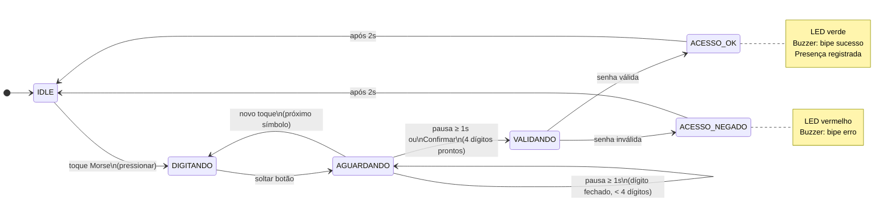

# Relatório — Sistema de Presença por Código Morse com Raspberry Pi 3

**Grupo R** — Laboratório de Processadores — Escola Politécnica da USP


| Integrante                     | NUSP     |
| ------------------------------ | -------- |
| Caique Granja Maia             | 12555572 |
| João Ricardo Rodrigues Ribeiro | 14582802 |
| Stephanie Pedrazza Grunwald    | 11233522 |


**Repositório:** [https://github.com/CaiqueG/LabProcGrupoR-ProjetoFinal](https://github.com/CaiqueG/LabProcGrupoR-ProjetoFinal)

---

## 1. Motivação e Justificativa

O controle de presença manual em sala de aula é um processo lento, sujeito a erros humanos e suscetível a fraudes (um aluno assinando por outro, por exemplo). Soluções digitais existentes geralmente dependem de conectividade à internet ou de hardware proprietário (leitores de crachá, biometria), o que aumenta o custo e a complexidade de implantação.

Este projeto propõe uma alternativa de baixo custo, autônoma e educativa: um sistema embarcado no **Raspberry Pi 3** que realiza o controle de presença por meio de **código Morse numérico**. Cada aluno possui uma senha de 4 dígitos que é inserida pressionando um único botão físico, combinando toques curtos (pontos) e longos (traços).

Além do aspecto prático, o projeto consolida diretamente os conceitos trabalhados ao longo do laboratório:

- **Decodificação por temporização** (Aula 2 e Aula 9): o sistema distingue ponto de traço pela duração do toque.
- **Especificação formal de requisitos** (Aulas anteriores): projeto orientado a RF e RNF desde o início.
- **PWM e temporização não-bloqueante** (Aula 9): arquitetura orientada a eventos, sem busy-waiting.
- **Integração de periféricos via GPIO e I2C** (Aula 10): LCD, botões, LEDs, buzzer e máquina de estados integrados.

Projetos similares de controle de acesso embarcado em Raspberry Pi podem ser encontrados em:

- Raspberry Pi Foundation — *Physical computing with Python*. Disponível em: [https://projects.raspberrypi.org/en/projects/physical-computing](https://projects.raspberrypi.org/en/projects/physical-computing)
- Freenove — *Freenove Ultimate Starter Kit for Raspberry Pi*. Disponível em: [https://docs.freenove.com](https://docs.freenove.com)

---


## 2. Objetivos


### 2.1 Objetivo Geral

Desenvolver um sistema embarcado de controle de presença em sala de aula, executado no Raspberry Pi 3, que permita a identificação de alunos por meio de senha numérica inserida em código Morse, com registro local e interface web de monitoramento.

### 2.2 Objetivos Específicos

1. Implementar um decodificador de código Morse numérico (dígitos 0–9, padrão ITU-R M.1677) capaz de distinguir pontos e traços pela duração do toque em um botão físico.
2. Integrar uma base de dados local (arquivo JSON) para validação de senhas e um histórico de presenças (arquivo CSV) com registro de data e hora.
3. Fornecer feedback multimodal ao usuário: LED verde/vermelho, bipe no buzzer e mensagem no display LCD 1602 via I2C.
4. Desenvolver uma interface web (Flask) acessível pela rede local, atualizada em tempo real, exibindo o estado do sistema e o histórico de presenças.
5. Garantir uma arquitetura não-bloqueante, baseada em eventos (callbacks de GPIO), para que a leitura de botões e o servidor web operem simultaneamente sem interferência.

---


## 3. Requisitos Funcionais


| ID   | Descrição                                                                                                                                                                                                | Critério de Aceitação                                                                                                |
| ---- | -------------------------------------------------------------------------------------------------------------------------------------------------------------------------------------------------------- | -------------------------------------------------------------------------------------------------------------------- |
| RF1  | O sistema deve decodificar dígitos Morse (0–9) a partir de toques em um botão físico. Toque < 0,3s = ponto; toque ≥ 0,3s = traço. Cada dígito é formado por exatamente 5 símbolos (padrão ITU-R M.1677). | Pressionar a sequência correta de toques resulta no dígito esperado exibido no LCD e na interface web.               |
| RF1b | Uma pausa ≥ 1,0s sem tocar fecha automaticamente o dígito atual e aguarda o próximo.                                                                                                                     | Após 1s de inatividade, o dígito é fechado sem necessidade de confirmação manual.                                    |
| RF2  | Ao confirmar 4 dígitos, o sistema valida a senha contra o cadastro local. Se válida, registra a presença com nome, data e hora em arquivo CSV.                                                           | Presença registrada aparece no histórico da interface web e no CSV. LED verde acende e buzzer emite bipe de sucesso. |
| RF2b | Se a senha for inválida, o sistema sinaliza o erro e retorna ao estado de espera.                                                                                                                        | LED vermelho acende, buzzer emite bipe de erro, nenhum registro é feito no CSV.                                      |
| RF3  | O botão Cancelar limpa o buffer de entrada a qualquer momento, retornando o sistema ao estado inicial.                                                                                                   | Após pressionar Cancelar, LCD exibe "Digite a senha em Morse" e buffer é zerado.                                     |
| RF4  | O sistema deve exibir feedback no display LCD 1602 durante toda a interação: símbolos digitados, senha parcial, resultado da validação.                                                                  | LCD atualiza a cada toque, exibindo o estado atual da entrada.                                                       |
| RF5  | Uma interface web deve exibir em tempo real o estado do sistema (senha parcial, símbolo atual, resultado) e o histórico das últimas 10 presenças registradas.                                            | Página acessível em `http://<ip>:5000` atualiza automaticamente a cada 1 segundo.                                    |


---


## 4. Requisitos Não Funcionais


| ID   | Descrição                                                                                                                                              | Critério de Aceitação                                                                                                   |
| ---- | ------------------------------------------------------------------------------------------------------------------------------------------------------ | ----------------------------------------------------------------------------------------------------------------------- |
| RNF1 | Tempo de resposta da interface web inferior a 1 segundo após a confirmação.                                                                            | Medição com DevTools do navegador: latência do endpoint `/status` < 1s.                                                 |
| RNF2 | Debounce de ~50ms nos botões; sequências Morse inválidas (< 5 símbolos ou sem mapeamento) devem ser descartadas sem travar o sistema.                  | Pressionar o botão rapidamente não gera múltiplos eventos. Sistema retorna ao estado de espera após sequência inválida. |
| RNF3 | Arquitetura orientada a eventos (sem busy-waiting): leitura de botões via callbacks, servidor web em thread separada da FSM, buzzer em thread própria. | Digitar a senha e acessar a interface web simultaneamente não causa travamento ou perda de eventos.                     |
| RNF4 | Resiliência de hardware: ausência de LCD ou buzzer não deve impedir o funcionamento do sistema.                                                        | Sistema inicializado sem LCD conectado exibe mensagens no console; sem buzzer, continua sem áudio e sem erro fatal.     |


---


## 5. Arquitetura da Solução


### 5.1 Arquitetura Física

O sistema é executado inteiramente no **Raspberry Pi 3 Model B** (SoC Broadcom BCM2837, ARM Cortex-A53 quad-core 1,2 GHz, 1 GB RAM, Raspberry Pi OS). Os periféricos são conectados diretamente aos pinos GPIO:


| Componente       | Interface     | Pino BCM        | Função                             |
| ---------------- | ------------- | --------------- | ---------------------------------- |
| Botão Morse      | GPIO digital  | 26              | Botão S4 da placa Freenove         |
| Botão Confirmar  | GPIO digital  | 18              | Botão externo na protoboard        |
| Botão Cancelar   | GPIO digital  | 23              | Botão externo na protoboard        |
| LED Verde        | GPIO digital  | 17              | LED da placa Freenove              |
| LED Vermelho     | GPIO digital  | 27              | LED externo na protoboard          |
| Buzzer passivo   | GPIO digital  | 12              | Conector Buzzer da placa Freenove  |
| Display LCD 1602 | I2C (SDA/SCL) | GPIO 2 / GPIO 3 | Conector I2C da placa Freenove     |


> **Nota sobre GPIO:** a decisão de usar `gpiozero` como biblioteca padrão em todos os módulos foi tomada a partir do conflito de drivers relatado na Aula 10, onde o uso simultâneo de `RPi.GPIO` e outra biblioteca causava falha na inicialização dos pinos.


### 5.2 Arquitetura de Software

O sistema é composto por seis módulos Python com responsabilidades bem definidas:


| Módulo             | Responsabilidade                                                                |
| ------------------ | ------------------------------------------------------------------------------- |
| `app.py`           | Inicializa a FSM em thread separada e serve a interface web via Flask           |
| `fsm.py`           | Máquina de estados não-bloqueante: gerencia entrada Morse, timeouts e validação |
| `morse_decoder.py` | Lógica pura de decodificação: recebe durações de toque e retorna dígitos        |
| `hardware.py`      | Abstração dos periféricos GPIO (botões via callbacks, LEDs, buzzer)             |
| `database.py`      | Leitura do cadastro JSON e gravação do histórico CSV                            |
| `lcd_driver.py`    | Wrapper do LCD com fallback para console se I2C não estiver disponível          |


**Fluxo de estados da FSM:**




> O botão **Cancelar** retorna a FSM a IDLE a partir de qualquer estado (transição omitida do diagrama para legibilidade).

**Mecanismo de concorrência:**

- **Thread da FSM** (`loop_temporizador`): verifica timeouts a cada 100ms usando `threading.Thread`.
- **Thread do Flask**: serve as requisições HTTP de forma independente da FSM.
- **Thread do buzzer**: toca o bipe sem bloquear a leitura dos botões.
- `threading.Lock`: protege o estado compartilhado (`status`) acessado pelas três threads.


### 5.3 Interface Web

A interface web (Semana 4) será servida pelo Flask na porta 5000 com polling a cada 1 segundo no endpoint `/status`, retornando estado do sistema e histórico de presenças em JSON.

---


## 6. Ferramentas Utilizadas

| Categoria | Ferramenta / Componente | Uso |
| --------- | ----------------------- | --- |
| Hardware  | Raspberry Pi 3 Model B (ARM Cortex-A53, 1,2 GHz) | Plataforma de execução |
| Hardware  | LCD 1602 + módulo I2C PCF8574 | Display de feedback |
| Hardware  | Botões push-button, LEDs, buzzer passivo | Entrada e feedback físico |
| Software  | Python 3.11+ | Linguagem principal |
| Software  | Flask 3.x | Servidor web e API REST |
| Software  | gpiozero 2.x + lgpio | Abstração GPIO |
| Software  | smbus2 | Comunicação I2C com LCD |
| Dev       | Git / GitHub + unittest | Versionamento e testes unitários |


---


## 7. Metodologia de Desenvolvimento

O projeto seguiu a mesma metodologia incremental adotada nas aulas práticas anteriores (Aulas 8, 9 e 10):

1. **Especificação de requisitos**: levantamento de RF e RNF antes da implementação, com casos de teste associados a cada requisito.
2. **Desenvolvimento modular**: cada componente (`morse_decoder`, `hardware`, `database`, `lcd_driver`) foi implementado e testado isoladamente antes da integração.
3. **Regra de ouro (Aula 10)**: nenhum componente foi integrado sem ter passado em seu próprio teste unitário ou teste isolado de hardware.
4. **Integração incremental**: módulos foram integrados um a um na FSM, verificando a ausência de conflitos de GPIO (lição aprendida na Aula 10 com o conflito `RPi.GPIO` × `gpiozero`).
5. **Controle de versão**: commits incrementais no GitHub para rastreabilidade da evolução do projeto.

---


## 8. Cronograma de Desenvolvimento

O projeto é desenvolvido de forma incremental ao longo de quatro semanas. A cada entrega, uma nova camada funcional é adicionada ao sistema, garantindo que sempre haja algo testável na placa ao final de cada semana.


| Semana | Foco                           | Componentes entregues                                                    | Demonstrável na placa                                                                     |
| ------ | ------------------------------ | ------------------------------------------------------------------------ | ----------------------------------------------------------------------------------------- |
| 1      | Base e decodificação Morse     | `morse_decoder.py`, `hardware.py` (botão + LEDs), `demo_morse.py`        | Pressionar botão → `.`/`-` no terminal, LED pisca, dígito exibido ao completar 5 símbolos |
| 2      | Feedback visual e persistência | `lcd_driver.py`, `lcd1602_driver.py`, `database.py`, `demo_validacao.py` | Digitar 4 dígitos em Morse → LCD mostra resultado, LED verde/vermelho, buzzer             |
| 3      | Integração via FSM             | `fsm.py` — máquina de estados completa                                   | Sistema completo funcionando na placa (sem interface web)                                 |
| 4      | Interface web e entrega final  | `app.py`, `templates/`, `static/`                                        | Sistema completo com monitoramento via browser                                            |


### 8.1 Entrega da Semana 1 — Base e Decodificação Morse

**Objetivo:** validar a lógica central do sistema (decodificação Morse) de forma isolada — primeiro sem hardware (testes unitários), depois na placa com botão e LED RGB.

**Artefatos entregues:** `src/morse_decoder.py`, `src/hardware.py`, `src/demo_morse.py`, `tests/test_morse_decoder.py`, `docs/relatorio.md`, `docs/diagramas/`.

**Demo no Raspberry Pi** (`python3 src/demo_morse.py`): toque curto → `.` + LED verde; toque longo → `-` + LED vermelho; 5 símbolos completos → dígito decodificado no terminal; sequência inválida → LED azul + buffer limpo.

**Requisitos cobertos:**

| Requisito | Cobertura |
| --------- | --------- |
| RF1 — Decodificação Morse | Completo (lógica + demo física) |
| RF1b — Fechamento por pausa | Completo (testado em TU-07 e no demo) |
| RNF2 — Sequências inválidas descartadas | Completo (TU-03, TU-04) |
| RF2, RF3, RF4, RF5 | Planejados — implementados nas Semanas 2–4 |

### 8.2 Resultados Obtidos — Semana 1

Os testes unitários foram executados na máquina de desenvolvimento antes da sessão de laboratório, com todos os 7 casos passando:

```
test_cancelar_limpa_buffer_e_senha ... ok
test_senha_completa_com_4_digitos ... ok
test_sequencia_de_5_simbolos_sem_mapeamento_retorna_erro ... ok
test_sequencia_incompleta_retorna_erro_e_nao_trava ... ok
test_todos_os_digitos_0_a_9 ... ok
test_toques_extras_apos_senha_completa_sao_ignorados ... ok
test_verificar_timeout_nao_fecha_antes_do_prazo ... ok

Ran 7 tests in 0.001s — OK
```

O demo `src/demo_morse.py` foi executado no Raspberry Pi com a placa Freenove. O botão S4 (GPIO 26) e o LED RGB (GPIO 5/6/13) responderam corretamente: toque curto acendeu o LED verde, toque longo acendeu o LED vermelho, e sequências inválidas acenderam o LED azul.

### 8.3 Lições Aprendidas — Semana 1

Dois problemas de usabilidade foram identificados durante o teste prático na placa:

**1. Ausência de botão para limpar o buffer**

Não há como o usuário desfazer uma digitação incorreta sem reiniciar o programa. Qualquer erro de toque obriga o usuário a aguardar 5 símbolos e depois tratar o erro. A adição de um **botão físico dedicado a cancelar/limpar** é essencial para a usabilidade do sistema e será implementada na Semana 2.

**2. Comportamento indesejado do timeout intra-dígito**

O comportamento atual do `morse_decoder.py` fecha o dígito (e o descarta como inválido) sempre que a pausa entre toques atinge 1 segundo, independentemente de quantos símbolos já foram registrados. Na prática, isso penaliza o usuário por demorar entre dois toques dentro do mesmo dígito, algo natural para iniciantes em Morse.

O comportamento desejado é:
- A pausa entre toques **não** deve fechar o dígito se ele ainda estiver incompleto (< 5 símbolos).
- O sistema deve continuar aguardando o próximo toque indefinidamente, preservando os símbolos já digitados.
- O dígito só deve ser validado após exatamente **5 símbolos** serem inseridos.
- O timeout de 1 segundo deve ser aplicado apenas ao **intervalo entre dígitos** (após o 5º símbolo), não dentro de um dígito.

Essa mudança requer revisão da lógica de `verificar_timeout()` em `morse_decoder.py` e será implementada na Semana 2.

### 8.4 Planejamento da Semana 2

Com base nas lições aprendidas, a Semana 2 incluirá: botão físico de cancelamento; revisão do timeout (pausa intra-dígito não descarta símbolos, apenas o intervalo entre dígitos completos dispara o fechamento); integração do LCD 1602 e buzzer; módulo `database.py` para validação de senha; e script `demo_validacao.py` unificando todos os componentes.

---


## 9. Testes Planejados

A estratégia de validação é dividida em dois tipos: testes **unitários** (executáveis sem hardware, em qualquer máquina) e testes **de hardware** (executados no Raspberry Pi com os periféricos conectados).

### 9.1 Testes Unitários — `tests/test_morse_decoder.py`

Testam exclusivamente `morse_decoder.py`, sem dependência de GPIO. Executar com: `python3 -m unittest tests/test_morse_decoder.py -v`

| ID    | Descrição                                              | Resultado Esperado                              | Status (S1) |
| ----- | ------------------------------------------------------ | ----------------------------------------------- | ----------- |
| TU-01 | Todos os 10 dígitos (0–9) decodificados corretamente   | Cada sequência de 5 símbolos retorna o dígito   | Passou      |
| TU-02 | Senha de 4 dígitos montada corretamente                | `decoder.senha == "0123"` após 4 dígitos        | Passou      |
| TU-03 | Sequência incompleta (< 5 símbolos) retorna ERRO       | `resultado == ERRO`, buffer limpo               | Passou      |
| TU-04 | Sequência de 5 símbolos sem mapeamento retorna ERRO    | `resultado == ERRO`                             | Passou      |
| TU-05 | Cancelar limpa buffer e senha                          | `decoder.senha == ""`, `buffer_simbolos == ""`  | Passou      |
| TU-06 | Toques extras após senha completa são ignorados        | `decoder.senha == "0000"` sem alteração         | Passou      |
| TU-07 | `verificar_timeout` não fecha dígito antes do prazo   | Retorna `None` imediatamente após o toque       | Passou      |

### 9.2 Testes de Hardware — Executados no Raspberry Pi

| ID    | Requisito | Procedimento                                                         | Resultado Esperado                                       | Status   |
| ----- | --------- | -------------------------------------------------------------------- | -------------------------------------------------------- | -------- |
| TH-01 | RF1       | `.----` (dígito 1): 1 toque curto + 4 toques longos                 | Dígito "1" exibido no terminal; LED verde/vermelho pisca | S1: OK   |
| TH-02 | RF1       | Sequência inválida `.-.-.` de 5 símbolos                            | Mensagem de erro; LED azul; buffer limpo                 | S1: OK   |
| TH-03 | RF2       | Digitar senha cadastrada e confirmar                                 | LED verde, buzzer sucesso, presença registrada no CSV    | Semana 2 |
| TH-04 | RF3       | Digitar 2 dígitos e pressionar Cancelar                             | Buffer zerado, sistema volta ao estado inicial           | Semana 2 |
| TH-05 | RNF2      | Pressionar botão rapidamente várias vezes (debounce)                | Apenas eventos com intervalo > 50ms são registrados      | Semana 2 |
| TH-06 | RNF4      | Iniciar o sistema sem LCD conectado                                 | Sistema inicia; mensagens no console; sem erro fatal     | Semana 3 |

---


## 10. Conclusões

### 10.1 Conclusão da Semana 1

A primeira semana de desenvolvimento estabeleceu com sucesso a base do sistema de controle de acesso por código Morse. Os objetivos propostos foram cumpridos: a lógica de decodificação Morse foi implementada, validada por 7 testes unitários e demonstrada em funcionamento no Raspberry Pi com a placa Freenove, utilizando o botão S4 (GPIO 26) e o LED RGB integrado (GPIO 5/6/13).

A abordagem de validar a lógica isoladamente, antes de qualquer integração com hardware, mostrou-se eficiente: todos os testes unitários passaram sem necessidade de ajustes, e os problemas identificados no teste físico foram de usabilidade, não de lógica.

**Pontos positivos:**
- A separação entre lógica (`morse_decoder.py`) e hardware (`hardware.py`) facilitou o teste isolado e a depuração.
- O uso de componentes integrados da placa Freenove eliminou a necessidade de fiação externa na Semana 1, acelerando o setup.
- A metodologia TDD, escrever testes antes de integrar ao hardware, provou seu valor ao garantir confiança no módulo central antes da sessão prática.

**Limitações identificadas:**
- A ausência de um botão físico para cancelar/limpar o buffer torna o sistema difícil de usar quando o usuário comete um erro de digitação, pois não há forma de desfazer um toque incorreto sem aguardar o fim do processo.
- O mecanismo de timeout intra-dígito penaliza usuários iniciantes em Morse: uma pausa natural entre dois toques do mesmo dígito invalida toda a sequência acumulada até aquele momento, causando frustração e perda de dados já inseridos.

**Encaminhamentos para a Semana 2:**
Ambas as limitações identificadas serão corrigidas na próxima entrega. Será adicionado um botão físico de cancelamento e a lógica de timeout será revisada para aguardar indefinidamente até a inserção do 5º símbolo, aplicando o timeout de intervalo apenas entre dígitos completos. Essas mudanças tornarão o sistema mais robusto e adequado ao uso prático na placa.

*(A conclusão final do projeto será elaborada na Semana 4, após a execução completa de todos os requisitos e testes de integração.)*

---


## Referências

RASPBERRY PI FOUNDATION. **Physical computing with Python**. Disponível em: [https://projects.raspberrypi.org/en/projects/physical-computing](https://projects.raspberrypi.org/en/projects/physical-computing). Acesso em: 27 jul. 2026.

GPIOZERO CONTRIBUTORS. **gpiozero Documentation**. Disponível em: [https://gpiozero.readthedocs.io](https://gpiozero.readthedocs.io). Acesso em: 27 jul. 2026.

FREENOVE. **Freenove Ultimate Starter Kit for Raspberry Pi — Tutorial**. Disponível em: [https://docs.freenove.com/projects/fnk0054/en/latest](https://docs.freenove.com/projects/fnk0054/en/latest). Acesso em: 27 jul. 2026.

INTERNATIONAL TELECOMMUNICATION UNION. **ITU-R M.1677-1: International Morse code**. Genebra: ITU, 2009. Disponível em: [https://www.itu.int/rec/R-REC-M.1677/en](https://www.itu.int/rec/R-REC-M.1677/en). Acesso em: 27 jul. 2026.

FLASK CONTRIBUTORS. **Flask Documentation (3.x)**. Disponível em: [https://flask.palletsprojects.com](https://flask.palletsprojects.com). Acesso em: 27 jul. 2026.

PYTHON SOFTWARE FOUNDATION. **threading — Thread-based parallelism**. Disponível em: [https://docs.python.org/3/library/threading.html](https://docs.python.org/3/library/threading.html). Acesso em: 27 jul. 2026.
